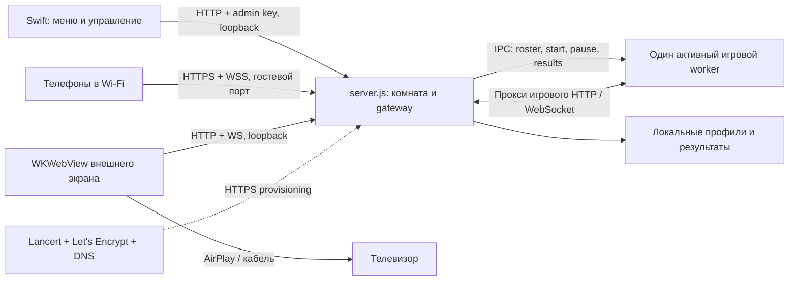
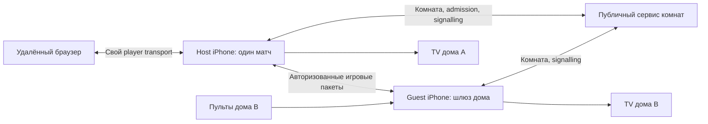

# HeyPals: состояние бэкенда и roadmap

## Принятый план надёжности LAN — 10 октября 2026

Baseline: `50ce020`, критическая перепроверка на M1 Max / Node 22.23.1. Сырые локальные результаты: `output/review-2026-10-10/evidence.json` (игнорируемые артефакты, не часть поставки). Пользователь разрешил реализацию и независимое ревью Critica. Дизайн и правила игр сохраняются.

1. Изолировать ошибки `/lobby` и Upgrade: неверный opcode, превышение 192 КиБ и некорректный URL не завершают процесс. Не продолжать работу через глобальное проглатывание uncaughtException.
2. Восстанавливать сетевой доступ при смене адреса/возврате приложения: отдельно желаемое состояние и действующий listener; сериализация операций, ограниченные повторы, сохранение явного выключения пользователем. Физическую блокировку iPhone не считать проверенной симулятором.
3. Общие правила доставки: ограниченное число неподтверждённых снимков, подтверждение от пульта и ТВ, последнее ожидающее состояние, повторная синхронизация; события не теряются. Совместимость неподдерживающих клиентов — явная.
4. Устранить повторную работу: стабильные UI deadlines, общая сериализация, ожидание только по изменениям, статические данные по версии, компактные личные снимки, дедупликация ввода с keepalive и немедленными переходами кнопок.
5. Удешевить загрузку: кеш обработанного CSS, проверяемое кеширование статических ресурсов и заранее подготовленное сжатие; не кешировать личный HTML/API. Объединять только некритичные рассылки.
6. Удешевить сохранение: фотографии отдельно, последовательная отложенная атомарная запись, flush при остановке/приостановке и важных результатах; миграция без потери данных.
7. Kart: удалить неиспользуемый поиск; дальнейшее ускорение nearest — только с проверкой эквивалентности столкновений/кругов и полным поиском при необходимости. Частоту физики не снижать.
8. Проверки: негативные сетевые сценарии, медленный клиент через gateway и напрямую, reconnect/пауза/результаты, нагрузка 16 клиентов, браузер и iOS Simulator; независимое ревью и исправление замечаний. AirPlay/тепло/реальная смена Wi-Fi требуют устройства. Опрос native/Bonjour и качество рендера менять только по дополнительным измерениям.

Критерии: отсутствие падений от клиента; ограниченная очередь устаревших снимков; отсутствие постоянной передачи одинакового ожидания; отсутствие залипшего ввода; сохранность профилей; снижение измеренной нагрузки без изменения механик.

### Реализация и повторная проверка — 10 октября 2026

Изменения выполнены в `network-optimisation`, поверх `50ce020`. Сырые измерения, логи сборки и снимки находятся в игнорируемых `output/implementation-2026-10-10/` и `output/playwright/`; массовые QA-артефакты в Git не добавляются.

**Надёжность.** Ошибки клиентских WebSocket и некорректного Upgrade изолированы от процесса. Сетевой доступ хранит желаемое состояние отдельно от действующего listener, сверяет адрес раз в секунду, закрывается при потере адреса/приостановке и повторяет открытие с ограниченной частотой. Выключение и приостановка не ждут зависшего provisioning; его запоздалый результат не публикует старый адрес. Возврат приложения запускает сверку. Это не отменяет зависимости HTTPS provisioning от внешнего сервиса.

**Доставка.** Обновлённые WebSocket-клиенты согласуют ACK-протокол: два неподтверждённых заменяемых снимка, одно последнее ожидающее состояние на канал. Надёжные события передаются последовательно, с пределом 32 неподтверждённых сообщений; при отставании клиент отключается для полной синхронизации вместо накопления очереди. Таймаут 2 секунды работает по реальному времени, в том числе на игровой паузе. ACK идёт после синхронной обработки сообщения, независимо от requestAnimationFrame. FIFO гарантирован между событиями; глобального порядка между событиями и отложенными заменяемыми снимками нет. Старые клиенты сохраняют прежний формат. Socket.IO-семейства Monster, Spy и Millionaire на этот протокол не переведены.

**Повторная работа.** Семантические изменения UI уходят сразу; коррекции вычисляемого дедлайна объединяются до 1 Гц. Это периодическая коррекция, а не новая модель авторитетных дедлайнов. Общий game-ui сериализуется один раз, некритичные рассылки комнаты объединяются в рамках оборота event loop. Неизменный непрерывный ввод использует keepalive 180 мс, отпускания и переходы кнопок сохраняют немедленную доставку. В Kart пульт получает своего игрока и общее количество, а полную таблицу — на результатах; трасса ТВ передаётся при подключении. Tank Arena передаёт арсенал один раз и сокращает поля чужих игроков. Ожидание обеих игр рассылается только при изменениях.

**CPU, загрузка и диск.** Kart исключает заведомо дальние сегменты до дорогой проекции, сохраняя точный результат и частоту физики. CSS-преобразования кешируются; JS/CSS получают ETag, сжатие и версию URL, встроенная сборка содержит заранее подготовленные варианты Brotli/gzip. Кеш ограничен, HTML и API не становятся долгоживущими публичными ресурсами. Фото профилей вынесены из metadata JSON; runtime использует одну последовательную асинхронную очередь атомарных записей с повтором после ошибки. Подтверждение регистрации и ответ управления ждут сохранения. Результаты запускают flush, приостановка и штатное завершение его ожидают. Неподтверждённые изменения при принудительном завершении процесса всё ещё могут потеряться.

### Измеренный эффект

Одинаковый стенд до/после: M1 Max, Node 22.23.1, loopback, gateway + игровой worker, 16 протокольных пультов и ТВ, активный ввод примерно 30 Гц. 16 — текущий лимит комнаты. Активное окно 5 секунд; ожидание 2,2 секунды после подключения. Это короткий замер серверной передачи, не испытание 16 физических телефонов и не замер задержки Wi-Fi. МБ здесь десятичные; объём — JSON игровых снимков ко всем пультам, без TCP/TLS и обратных ACK.

| Проверка | До | После |
| --- | ---: | ---: |
| Kart, активная игра: суммарно к пультам | 2,223 МБ/с | 0,191 МБ/с (−91,4%) |
| Kart: частота состояния одного пульта | 19,60 Гц | 19,60 Гц |
| Tank Arena, активная игра: суммарно к пультам | 2,493 МБ/с | 1,029 МБ/с (−58,7%) |
| Tank Arena: частота состояния одного пульта | 29,20 Гц | 29,19 Гц |
| Kart / Tank Arena: повторные игровые снимки в ожидании | 1,582 / 2,244 МБ/с | 0 / 0 после начальной синхронизации |
| Tank Arena / Hungry: lobby game-ui | 13,4 / 18,6 Гц | около 0,8 / 0,8 Гц в окне замера |
| Kart: чтение сокета остановлено на 8 секунд, устаревшие снимки за первые 300 мс после возврата | 146 через gateway / 118 напрямую | 0 / 0; отключение 1013 для reconnect |
| Повторная загрузка страницы: вызовы CSS fallback | 10, около 74 мс | 0 |
| Kart nearest, микротест `--jitless`, 12 000 вызовов | 60,7 мкс/вызов | 43,4 мкс/вызов |

В Hungry сокращена общая UI-рассылка, но сами игровые снимки в этом проходе не уменьшены: 0,312 → 0,425 МБ/с при 9,2 → 12,4 Гц. Этот результат нельзя представлять как снижение общего трафика всех игр. Общие CPU/RSS, задержку input-to-render и расход батареи этими измерениями не доказываем.

Микротест сохранения 200 профилей с фото по 96 КиБ: повторная запись metadata вместо 25,03 МиБ составляет 0,036 МиБ; синхронный совместимый API в тесте — 64,4 → 0,35 мс медианы после первого сохранения. Это иллюстрирует исключение повторной сериализации фотографий; первая миграция остаётся дороже. Производственный runtime использует отложенную асинхронную запись, а не этот синхронный тестовый путь.

### Свежие проверки и ревью

- `npm test`: **754/754**, затем все дополнительные игровые интеграционные проверки скрипта — PASS. Новые постоянные регрессии: `tests/lan-reliability.test.cjs`, `tests/kart-nearest.test.cjs`. Поиск трассы сравнен с полным эталоном на 10 000 случайных точек и точках трассы.
- Отдельные реальные сетевые пробы: oversized `/lobby`, неверный opcode, некорректный Upgrade URL и испорченный JSON не завершают процесс. Проверены смена/потеря адреса, suspend/resume, отключение во время незавершённого provisioning и восстановление после ошибки listener.
- Critica независимо проверил изменения и помог устранить ожидание provisioning при suspend, отсутствие повтора после ошибки записи, накопление старых фото/сжатых файлов и неправильное кеширование HEAD. Повторное ревью не оставило блокирующих замечаний. На Snakelines у здорового ТВ 68 последовательных состояний без разрыва trailFrom; отстающий ТВ ограничен 32 событиями, reconnect получает полную линию с trailFrom=0.
- Xcode 27 / iOS 27: актуальная Debug-сборка успешно собрана, установлена и запущена в iPhone 18 Pro Simulator. Проверки `verify-ios-product.py` и каталога подтвердили упаковку 32 игр.
- Реальный нативный WKWebView с обоими bridge и tabs: Kart и Tank Arena прошли ожидание, старт, паузу, правила и возврат в каталог. Свежие снимки контроллеров и ТВ просмотрены; данные трассы, оружия, здоровья, места и числа участников отображаются. Пульт вернулся из 21-секундного фона в `lobby-connected`, профиль сохранился. ТВ здесь — WebKit на Mac, не AirPlay.
- Браузер: Kart — игра, пауза/возобновление и reconnect; Tank Arena — игра и итоговая таблица с обоими участниками. Ошибок JavaScript в проверенной сессии нет. Это проверка конкретных затронутых состояний, не всех экранов 32 игр.

### Что проверять дальше

1. Физический iPhone: смена Wi-Fi/адреса, блокировка и длительный фон, AirPlay, повторный вход после сетевого разрыва. Симулятор не подтверждает поведение радиосети и фоновые ограничения устройства.
2. Длительная партия на устройстве с несколькими реальными пультами: p95/p99 input-to-render, CPU/RSS, нагрев и батарея. Уменьшение числа байтов не равно доказанному ускорению каждого кадра.
3. Socket.IO-семейства и оставшиеся тяжёлые TV payload — отдельный проход после замеров; не переносить их механически на заменяемые снимки, если сообщения несут приращения состояния.
4. На снимке Tank Arena TV 1280×720 панель статистики частично перекрывает первую строку списка игроков. Нужна отдельная UI-проверка с сопоставлением baseline; в рамках сетевой работы расположение панелей не менялось.

## Исторический аудит — 9 октября 2026

Дата аудита: **9 октября 2026**. Ветка: `heypals/ux-polish`. Проверенная ревизия: `db5e4f4a2163e772bf42e95d6cb7be4e048276f7` (8 октября). В начале рабочее дерево было чистым; локальная remote-tracking ссылка `origin/heypals/ux-polish` совпадала с HEAD. Fetch и проверка облачных аккаунтов не выполнялись.

**Рекомендация:** сохранить одну авторитетную симуляцию на iPhone ведущего, сначала уменьшить повторную передачу и обработку состояния, затем добавить отдельный интернет-транспорт и сервис комнат. Начинать с переноса всей физики в облако сейчас оснований нет. Интернет расширяет доступность, но сам по себе не ускоряет локальную игру.

Этот документ — новая точка отсчёта для backend/network работы. UI и игровые правила в этом аудите не менялись. Ниже отдельно обозначены реализация, свежие проверки и ещё не выполненные работы.

Продолжение по новому приоритету пользователя: [локальный runtime — аудит всех семейств, замеры и предложения](local-runtime-audit-2026-10-09.md). Интернет пока отложен. Сначала обсуждается анализ; экспериментальные изменения этапа B отменены в исходниках.

**Обновление после реализации:** по запросу пользователя удалены Jenga, DrawGuess, Crane и One Cursor Chaos; актуальный каталог — **32 игры / 16 семейств**. Реализованы два прохода локальной оптимизации, включая очереди, защиту транспорта, управление и кэш каталога. Актуальные изменения и проверки: [отчёт реализации](qa/runtime-optimization-2026-10-09/implementation.md). Нижеследующий аудит сохраняет исторический снимок до этих изменений.

## 1. Что изменилось и чему доверять

Личная история предыдущей сессии не является надёжным baseline. Для конкретного сравнения использованы последний предыдущий commit `40e4939` от 4 октября и текущий `db5e4f4`; более ранняя архитектура сверена с сентябрьскими документами.

| Область | Текущее состояние / изменение |
| --- | --- |
| Каталог | **36 игр, 20 серверных семейств**, по `lib/catalog.js`. Корневой README всё ещё описывает 26 игр, iOS README — 30. |
| Локальная архитектура | Desktop gateway и встроенный iPhone runtime уже существовали до последнего commit. Последний commit не заменил их облачным сервером. |
| Повторный матч | Добавлен общий `rematch(instance)`: дедупликация конкурентных запросов, новый instance, сохранение готовности присутствующих игроков, обработка неудачного перезапуска. |
| Запуск из предложения игры | Добавлен `spotlight-launch` от зарегистрированного игрока с проверками экрана, количества игроков и текущего запуска. Интернет-политика должна сохранить этот осознанный сценарий, а не объявить весь запуск исключительно администраторским. |
| Данные | Добавлены накопленная активность игр и `coins` с совместимостью старых `points`; базовая награда осталась 10 за участие + 30 за победу. |
| Интернет-комнаты | Добавлены продуктовый контракт, UI-точка `configureOnline()` и отдельный Node-пример сигналинга. Production adapter, игровой online transport и переключение удалённого TV отсутствуют. |
| Производительность | Последние проходы в основном относятся к WebView, сценам, видимости и повторным DOM-обновлениям. Их цифры нельзя выдавать за ускорение Node/физики. |
| Версии | `package.json`: 0.6.2; Xcode project: 0.11.7 (130); commit говорит «through build 147»; `/api/health` возвращает `sports-siege-alpha.1`. Эти метки описывают разные вещи и сейчас не дают однозначной идентификации установленного продукта. |

Прочитаны README приложения/iOS, online-документы от 7 октября, сентябрьские infrastructure/stability материалы, performance242–244 и каталоговый аудит performance243, а также соответствующий серверный и нативный код. Это аудит бэкенда и его границ, не повторная проверка сотен визуальных QA-артефактов.

## 2. Как сейчас проходит игра



### Процессы, порты и роли

| Компонент | Где работает | Адрес и назначение |
| --- | --- | --- |
| Desktop launcher | Node.js на компьютере | Один публичный LAN listener на `0.0.0.0`, порт из `PARTY_PORT` или свободный. HTTP по умолчанию; HTTPS при PFX-конфигурации. |
| iOS launcher | NodeMobile на отдельном потоке приложения | Внутренний HTTP на `127.0.0.1`, предпочтительно 8081. Управление `/api/manage` требует loopback и случайный Bearer key. |
| iOS гостевой вход | Второй listener того же launcher | HTTPS, предпочтительно 8080, фактически bind `0.0.0.0`. `boundAddress` хранит выбранный Wi-Fi IP, но не ограничивает bind этим интерфейсом. Все запросы маркируются `partyPublic`, поэтому даже обращение к этому порту через loopback не даёт admin-доступ. |
| Активная игра | Desktop: дочерний процесс; iOS: `worker_threads` | Свой случайный loopback-порт. Gateway отдаёт `/games/<id>/…` и проксирует соединения. На iPhone предыдущий worker останавливается до создания нового. |
| TV | Browser или отдельный WKWebView внешней сцены | Обычно получает состояние и рисует сцену. Исключение: Chaos считает игру в браузере ТВ, сервер пересылает команды. В native-режиме действует `PARTY_DISPLAY_ONLY=1`; управляющие действия идут из приложения через IPC. |
| Сигналинг PoC | Только при отдельном ручном запуске примера | `127.0.0.1:8791`, только комнаты и SDP/ICE; к приложению не подключён. |

Основные файлы: [server.js](../server.js), [NetworkAccess](../lib/network-access.js), [game-worker](../lib/game-worker.cjs), [party-runtime](../lib/party-runtime.js), [ServerModel](../ios/LocalParty/ServerModel.swift), [ExternalDisplay](../ios/LocalParty/ExternalDisplay.swift).

Один сервер хранит одну активную игровую сессию, максимум 16 участников в лобби; у отдельных игр лимиты ниже. Глобального сервиса аккаунтов, общего matchmaking, облачной статистики и нескольких независимых матчей внутри launcher сейчас нет.

### Протокол и жизненный цикл

- `/lobby` передаёт состав, профиль, готовность, паузу, выбор игры и переходы. Сама игра дополнительно использует собственное соединение через gateway.
- Большинство семейств используют `ws`; Monster, Spy и Millionaire — Socket.IO; Party и Tanks содержат собственную реализацию WebSocket framing. Одного механического переноса URL недостаточно.
- `public/bridge.js` адаптирует WebSocket/Socket.IO и identity; gateway переписывает HTML/JS/CSS под игровые маршруты. Это существующий слой совместимости, а не общий версионированный сетевой протокол.
- Большинство симуляций авторитетны в серверном worker ведущего; Chaos — исключение с симуляцией на ТВ. Например, Party считает шаги и отдаёт TV snapshots около 30 Hz; Kart считает 60 Hz и рассылает состояние каждые 50 ms; Sports считает фиксированные шаги 60 Hz, TV получает примерно 20 Hz, обычные пульты — примерно 10 Hz с уменьшенным payload.
- У матча есть `instance`, у запуска launcher — `bootId`. Готовность учитывает реальное подключение игрового сокета; запоздалые команды старого матча отклоняются. Короткие разрывы восстанавливают identity, рестарт launcher не восстанавливает физическое состояние матча.
- В runtime есть общий clock паузы, roster, presence, отчёт о результате и native host-команды с дедупликацией. Heartbeat сети продолжает работать на паузе.
- Боты сейчас живут в скрытых браузерных контроллерах на одном выбранном TV. Их тестовая сессия не попадает в постоянный рейтинг; нагрузка ботов включает браузер и не равна нагрузке физических телефонов.

### HTTPS, обнаружение и внешние зависимости

[lancert-https.js](../lib/lancert-https.js) регистрирует домен, указывающий на частный IP телефона, и через DNS-01 получает сертификат Let's Encrypt. Ключи и запись регистрации сохраняются локально. Это доверенный **локальный HTTPS**, не tunnel и не relay. Роутер с DNS-rebinding protection может блокировать такое имя. Даже повторное использование сертификата проходит DNS-проверку; полноценную независимость включения гостевого HTTPS от интернета обещать нельзя.

При смене IP создаётся/подбирается новая HTTPS-конфигурация. При смене адреса активный listener и published URL нужно проверять отдельно: фильтрация старого URL в `sharedURLs()` сама по себе не является полным network-change coordinator. При приближении срока сертификата переиздание происходит в `forAddress()`; отдельного планового обновления сертификата уже открытого listener не обнаружено.

[NearbyRooms.swift](../ios/LocalParty/NearbyRooms.swift) использует Bonjour `_localparty._tcp.`, обновления присутствия и удаление устаревших соседей. Это только локальное обнаружение. `joinRoom()` в [LocalPartyApp.swift](../ios/LocalParty/LocalPartyApp.swift) меняет URL пульта; внешний TV продолжает принадлежать локальной сессии.

Wi-Fi listener изначально выключен на стороне Node, но Swift автоматически пробует включать его в foreground, если пользователь ранее явно не запретил sharing. Поэтому старое описание «только после ручного включения» не полностью описывает текущий запуск. Запрос продолженной фоновой работы привязан к явному действию; автоматическая попытка sharing его не заменяет.

Другие внешние зависимости: GitHub для desktop updater и подготовки runtime; системный AirPlay для вывода; App Clip invitation как отдельный сценарий входа. App Clip и Bonjour не реализуют интернет-сессию. Гостевой браузер в обычной LAN-игре получает игровые ресурсы с телефона ведущего.

### Хранение и iOS runtime

Профили, токены, фото, результаты и настройки сохраняются в `data/party.json`, на iOS — в Application Support. `ProfileStore.save()` синхронно сериализует весь JSON, пишет temporary file и переименовывает его. Это атомарная замена файла, но не транзакционный журнал или восстановление незавершённой игры. Сохраняются последние 500 событий; накопленные счётчики живут отдельно. Явного общего ограничения числа сохранённых профилей нет; фото допускает до 96 KiB на профиль.

Неизменный reconnect уже не вызывает лишнее сохранение профиля. Однако сохранение комнаты вызывается и для ряда управляющих действий; размеры профилей/фото увеличивают стоимость всей записи. Первым шагом следует измерить запись и сериализацию, а затем ввести последовательную очередь сохранения с обработкой ошибок и гарантированной фиксацией результатов. Просто заменить sync на async без порядка записей нельзя.

На iOS закреплён **nodejs-mobile 18.20.4**, запуск `--jitless --no-experimental-fetch`. Desktop-контракт — Node >=20, текущий тестовый Mac использовал 22.23.1. Текущий [mobile-physics.cjs](../lib/mobile-physics.cjs) включает native Rapier для Jenga/Bowling (3D) и Crane (2D). Упоминания других игр в старом iOS README не следует считать актуальной картой physics backend.

Node 18 уже EOL у upstream. Это повод проверить поддержку и обновление именно mobile runtime, V8/OpenSSL и native bindings; наличие EOL само по себе не доказывает конкретную эксплуатируемую уязвимость сборки. Простое изменение `engines` не обновит iPhone binary. [Node.js releases](https://nodejs.org/en/about/previous-releases).

## 3. Что действительно запущено и настроено

На этом Mac до и после проверок не обнаружен TCP listener HeyPals/Node/LocalParty. Контейнер `openplan3d-planner-1` публикует `127.0.0.1:5173` и относится к другому проекту. Остальные наблюдавшиеся listeners принадлежали системным службам и GitKraken. Тестовые экземпляры этого аудита остановлены.

В отслеживаемом репозитории не обнаружены production Worker/DO deployment, Wrangler bindings, Terraform, Docker-конфигурация HeyPals, TURN credential endpoint или заданный online service adapter. В аккаунты провайдеров аудит не входил: **отсутствие конфигурации в checkout не доказывает отсутствие сервиса где-то вне репозитория**. Состояние установленного физического iPhone также не проверялось.

| Уже есть | Пока не настроено / не подтверждено |
| --- | --- |
| Локальный HTTP/WSS gateway, разделение native admin и гостевого входа | Production интернет-ingress с явными capabilities |
| Lancert/ACME клиент и локальный certificate cache | Независимый от чужого DNS-service эксплуатационный план, проверка текущей доступности Lancert |
| Bonjour, профили, reconnect, pause, rematch | Online admission, lease/rejoin grace, remote TV attach |
| Локальный signalling PoC: tokens, epoch, expiry, throttling | Durable room storage, подтверждённые guest reservations, отдельные player/display credentials, TURN |
| CI-файлы и обширный набор тестов | Автоматический backend gate для push в `heypals/ux-polish` |
| Desktop updater с rollback-механизмом | Актуальный release channel: alpha сейчас закреплён на `alpha/sports-siege-swipe`, не на текущей ветке |
| RSS, максимум задержки launcher loop, lifecycle log | Worker CPU/tick percentiles, bytes/sec по каналам, очередь, drops, reconnect latency, единая версия протокола и ассетов |

CI: `ios-show-validation.yml` запускается на push в старую `codex/ios-unified-host-20260917`; `alpha-sports-siege.yml` — в старую alpha-ветку и на PR с ограниченным path filter. Поэтому утверждение «есть workflow → текущий push автоматически проверен» неверно. Успешные удалённые GitHub runs в этом аудите не проверялись.

## 4. Свежая проверка и первые измерения

**29/29 проверок прошли**, последовательно, Node 22.23.1, около 33,6 s. Покрыты профиль/результаты, часы и правила паузы, mock ACME, доставка важных сообщений при backlog, reconnect восьми клиентов, adversarial reconnect 16 клиентов с двумя seed, старые instance, embedded start, rematch, spotlight launch и три signalling-теста.

Первый прогон внутри файловой/сетевой песочницы не смог открывать loopback (`listen EPERM`): 18 pass / 11 fail. После разрешённого повторного запуска с локальными listeners все 29 прошли. Это ограничение среды, а не исправленный дефект приложения. Полный `npm test`, реальные сертификаты, AirPlay, iOS build, WAN/TURN и все состояния 36 игр в этом проходе не проверялись.

Доказательства: [успешный лог](qa/backend-audit-2026-10-09/tests.log), [первый sandbox-прогон](qa/backend-audit-2026-10-09/sandbox-tests.log), [сырые измерения](qa/backend-audit-2026-10-09/probe.json), [скрипт измерения](qa/backend-audit-2026-10-09/probe.cjs).

### Локальный сетевой замер Kart

Настоящий launcher в embedded-mode и настоящий worker на Mac, восемь синтетических WS-участников, один получатель игрового состояния для TV. Фаза playing, 5,002 s, без управляющего ввода, renderer, нативной физики, AirPlay или WAN. Размеры — JSON payload, без TCP/TLS overhead. Это короткая диагностическая выборка, не нагрузочная сертификация.

| Наблюдение | Результат | Что из него следует |
| --- | --- | --- |
| `/api/manage`, пустая комната | 56 279 bytes | Большой payload присутствует ещё до матча. |
| `/api/manage`, восемь игроков, активный Kart | 59 074 bytes | Нативный `refresh()` запрашивает полный ответ после паузы 900 ms между запросами. |
| Поле `catalog` в активном ответе | 54 023 bytes, около 91% | Каталог следует передавать по revision, отдельно от частых обновлений комнаты. |
| Игровые данные на каждый пульт | 97 snapshots, 1 326 330 bytes за выборку | Около 265 KB/s на один пульт; 8 пультов + TV — около 2,39 MB/s JSON fan-out. |
| Одинаковый payload всем девяти получателям | Подтверждён одинаковый объём | Kart передаёт весь `TRACK` и игроков, сериализуя состояние заново для каждого socket. |
| Launcher metrics после выборки | RSS 113 MB; max loop delay 2 ms | Не свидетельствует о медленной симуляции. RSS — процесс Node с worker; это не память всего iOS-приложения. |

Размер полного ответа при текущем интервале даёт порядок 60–66 KB/s на один native poller без учёта времени запроса. Это **расчёт**, не замер фактического polling трафика Swift в данном прогоне. Loopback-байты не расходуют домашний интернет, но требуют сериализации, передачи и декодирования на телефоне.

### Очередь оптимизаций локального сервера

1. **Разделить неизменяемые данные и live-state.** Каталог/правила/схемы настроек по revision; состояние комнаты и health компактно. Сохранять bootstrap для первого открытия и полного восстановления после пропуска обновлений.
2. **Сократить Kart payload по роли.** Трасса один раз по version/hash; TV получает координаты мира, пульт — нужные ему данные. Общий snapshot сериализовать один раз, private state — отдельно. Сначала Kart как измеримый пилот, затем другие семейства.
3. **Унифицировать backpressure.** В launcher и части engines уже есть пороги 256/512 KiB и пропуск устаревающих state. Это не единая очередь latest-state для всех протоколов; `selfState`, Socket.IO и custom frames требуют отдельной проверки. Не терять join/ready/results/shot acknowledgements. Тестировать медленного получателя, который затем восстанавливается.
4. **Снизить работу persistence.** Измерить размер файла и write p95, добавить последовательное сохранение, коалесцирование настроек и гарантированную фиксацию результатов; фото вынести из часто перезаписываемой структуры, если замеры это оправдают. SQLite — возможный следующий шаг, не обязательная первая миграция.
5. **Кэшировать действительно статические ресурсы.** Сейчас shell/game ответы часто `no-store`, proxy буферизует и преобразует текст, часть игр читает файлы синхронно. Версионированные assets и безопасный cache преобразованных ресурсов уменьшают стоимость входа/rejoin. Нельзя кэшировать чужие credentials, host bootstrap или приватное состояние как общедоступную статику.
6. **Измерить worker отдельно.** Tick duration, отставание фиксированного шага, GC/heap, serialization CPU, bytes/sec, backlog age, dropped snapshots, startup-to-ready. Текущий секундный max loop delay launcher не измеряет дедлайны физики в worker.

Частоту input и physics tick, правила, разрешение сцены и дизайн по умолчанию не снижать. Приоритет — удалить повторную работу. Рендеринг и AirPlay профилировать отдельным треком совместно с владельцем UI; прошлые browser CPU-улучшения не смешивать с backend-замерами.

## 5. Целевая интернет-архитектура



Сервис комнат: Cloudflare Worker + SQLite-backed Durable Object на комнату, атомарное резервирование шестизначного кода, lease/epoch, admission, scoped credentials, rate limits. DO подходит для координации WebSocket-клиентов; hibernation полезен во время ожидания, при восстановлении нужно вернуть durable state и socket attachments. Частые snapshots через DO не следует считать бесплатным спящим сигналингом. [Официальный WebSocket/Hibernation API](https://developers.cloudflare.com/durable-objects/best-practices/websockets/).

Игровой путь: целевой кандидат — WebRTC DataChannel для native и browser, с TURN fallback. Сигналинг требуется отдельно; TURN нужен для случаев, где прямое соединение не устанавливается. Это не возможность просто направить публичный код на частный LAN-IP. [WebRTC peer connections](https://webrtc.org/getting-started/peer-connections).

Короткий WSS relay-прототип допустим для проверки общего adapter и одного матча. Он должен принимать только разрешённые логические каналы и исходящее соединение host; нельзя туннелировать весь loopback HTTP API. Не строить две полные production реализации до измерения нативного WebRTC на устройстве. WSS и WebRTC должны разделять один packet/capability contract.

У документа [online architecture](online-architecture-2026-10-07.md) WSS-first путь, а у [free test](online-free-test-2026-10-07.md) — WebRTC-first. Здесь это сводится к одному решению: сначала контракт + ограниченный transport spike, после его результата выбрать путь первого игрового beta. Успешный локальный signalling-тест не считается таким spike.

TURN backend хранит долгоживущий ключ и выдаёт временные credentials. Провайдера можно заменить за этим интерфейсом; Cloudflare поддерживает такую выдачу. Для эксперимента без платежей прежний кандидат — Metered Open Relay; его текущая страница публикует бесплатную квоту 20 GB. Доступ конкретного аккаунта и включённые тарифы здесь не проверены. Перед подключением сверить квоту и billing, установить бюджет теста; полную старую таблицу цен не считать бессрочной. [Cloudflare credentials](https://developers.cloudflare.com/realtime/turn/generate-credentials/), [TURN FAQ](https://developers.cloudflare.com/realtime/turn/faq/), [Open Relay](https://www.metered.ca/tools/openrelay/).

### Обязательный общий контракт

- Handshake: protocol version, asset/catalog revision, capabilities, room epoch, match instance. Версия ресурсов браузера должна совпадать с host; нужны manifest и публичный HTTPS origin для статических ресурсов.
- Отдельные роли host, participant, display; возможность игрока pause/vote/spotlight сохраняется по продуктовой политике. Код комнаты — lookup, не право администратора. Публичный ingress не наследует доверие `local(req)` или cookie, автоматически выдаваемой каждому посетителю `/tv` в LAN.
- Команды/результаты/переходы: надёжная доставка, command ID, ack, dedup. Быстро устаревающий input: seq и latest-value. Снимки: tick/revision и timestamp; delta только после соответствующего baseline, иначе resync.
- Private state: только нужному игроку. Нельзя размножить полный host packet всем участникам для Spy, Poker, Naval, Quiz и других игр с секретами. Display credential тоже не означает доступ ко всем приватным данным.
- Guest coordinator атомарно присоединяет пульт и внешний TV к одному instance; guest не запускает вторую симуляцию. При leave оба возвращаются в свою комнату; при частичной ошибке join откатывается.
- Один native guest transport на дом может обслуживать несколько логических пультов и TV. Participant ID не равен peer ID; авторизацию каждого игрока проверяет host. Для браузера без приложения нужен самостоятельный путь входа.
- Disconnect/rejoin: ограниченная grace period, восстановление baseline, нейтральный input при потере связи, контроль lease и запрет старого epoch. В v1 уход ведущего завершает/приостанавливает сессию по явному правилу; host migration не обещается.

На длинных RTT локальные игры на реакцию потребуют отдельных решений о справедливости, input timestamp и возможной компенсации задержки. Запуск пакетов через интернет сам по себе не делает Western/Kart пригодными к любому пингу. Правила компенсации — отдельная продуктовая работа с проверкой защиты от поддельного времени клиента.

## 6. Roadmap с критериями завершения

Этапы ниже — предлагаемый порядок, не уже выполненные изменения. Сроки стоит фиксировать после нативного transport spike: именно он содержит основной неизвестный объём работы.

| Этап | Конкретный результат | Критерий выхода / зависимости |
| --- | --- | --- |
| **A. Воспроизводимая база — первый PR** | Актуальные CI branch/path triggers, отдельный backend test gate, единая build/protocol metadata, короткий runbook портов и режимов. Проверить/исправить desktop update channel без изменения текущей установки. | Чистый checkout запускается; CI проверяет текущую ветку; health/build manifest однозначно указывает исходники. Зафиксирована физическая LAN-база 2/8 игроков; 16 — где позволяет игра. |
| **B. Наблюдаемость и дешёвый LAN** | Метрики launcher/worker/transport; revision каталога; пилот compact Kart state и serialize-once; измеренное улучшение persistence. | Три сопоставимых before/after прогона, меньше bytes и serialization work; нет ухудшения input/ready/reconnect/результатов. Реальный iPhone + TV, 30–60 минут; память/очереди не растут неограниченно. A → B. |
| **C. Runtime и границы доверия** | Решение по поддерживаемому NodeMobile; совместимость native physics; общий контракт ролей/версий/лимитов, единый policy transport. Явные recovery credentials вместо переноса LAN-доверия к `clientId` в WAN. | Тесты malformed/flood/slow receiver/role spoofing/private data; публичный путь не выдаёт admin. LAN работает при выключенной online-функции. A → C; часть можно делать вместе с B. |
| **D. Узкий интернет-spike** | Rooms/lease/admission + выбранный transport; один native host, один удалённый guest с TV, browser guest; versioned assets. Начать с простого WS-движка и добавить динамический Push для задержки. | Две физические сети, cellular/CGNAT, один матч и результаты на двух TV; отдельно forced TURN, перезаподключение и mismatch версии. Controller-only join не принимается. C → D. |
| **E. Закрытая beta** | Поэтапно подключены WS, custom WS, Socket.IO; test matrix private state и lifecycle. Allowlist проверенных игр; метрики TURN расхода и лимитов. | Сценарии loss/jitter, смена Wi-Fi, host background, return/rematch, полный/старый код, медленный TV; 2/8/16 игроков в пределах механики. Непроверенные игры скрыты из online. B + D → E. |
| **F. Эксплуатация** | Staging/production, secret rotation, deploy/rollback, room cleanup, мониторинг join failures/latency/cost, поддерживаемые protocol versions. | Повторяемый deploy, понятное поведение при отказе провайдера/квоте, LAN автономен от room service, длительные реальные тесты. E → F. |

Первые независимые backend задачи после принятия roadmap: A (CI/идентификация сборки), затем B1 (метрики и каталог по revision), B2 (Kart snapshot projection), C1 (native runtime и transport contract). UI-разработчик подключается к native coordinator и browser adapter по согласованным интерфейсам; параллельное редактирование его экранов для начала не требуется.

**Отдельно от первого online-релиза:** аккаунты, облачная синхронизация статистики, публичный matchmaking, экономика, host migration, dedicated authoritative servers. Удалённый game server оправдан, если нужен матч после ухода/блокировки ведущего, нейтральная авторитетность или доказано, что целевой iPhone не выдерживает физику. Тогда сначала переносится один engine за уже созданным контрактом; постоянная БД и горизонтальное размещение матчей проектируются под эту цель. Relay уменьшает проблемы достижимости, но не переносит CPU симуляции с телефона.

## 7. Повтор проверки и границы доказательств

Из корня репозитория:

```sh
node --test --test-concurrency=1 \
  tests/profile-store.test.js tests/session-controls.test.cjs \
  tests/lancert-https.test.js tests/lobby-backpressure.test.js \
  tests/reconnect-load.test.js tests/adversarial-reconnect.test.js \
  tests/session-transition-regression.test.js tests/embedded-ready-start.test.js \
  tests/rematch-integration.test.cjs tests/spotlight-network.test.js \
  tests/bridge-instance.test.js examples/online-room-signalling242/server.test.cjs
node docs/qa/backend-audit-2026-10-09/probe.cjs
```

Probe создаёт временные данные, использует loopback и завершает свои сокеты/worker. Новый результат пишет в stdout; сохранённый `probe.json` относится именно к этому аудиту. Некоторые существующие desktop tests по архитектуре launcher слушают `0.0.0.0` на временных портах. Для тестов нужны разрешения среды на listeners. ACME test использует mock-сервис и временный self-signed сертификат: он не проверяет текущий Lancert/Let's Encrypt.

Ограничения: нет доступа к облачным dashboard, нет свежего физического iPhone/AirPlay evidence, нет WAN-теста и server CPU before/after. Возможные hot paths по коду обозначены кандидатами, а измеренные payload вынесены отдельно. Визуальных изменений нет; «все экраны проверены» этот аудит не утверждает.
