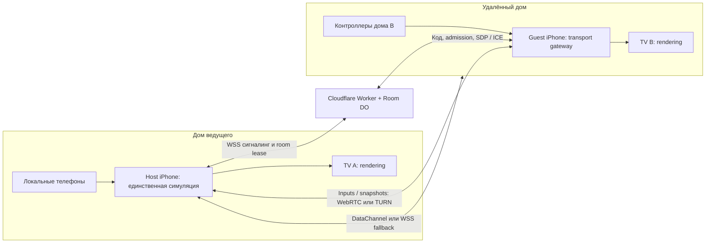

# HeyPals: интернет-комнаты и общий матч на нескольких TV

Исследование и проверка репозитория: **7 октября 2026**. Только официальные источники. Цены ниже — текущие опубликованные условия, не обещание бесплатной работы без лимитов.

**Рекомендация:** сохранить iPhone ведущего как единственный сервер игры. Для первого рабочего интернет-сценария добавить исходящее WSS-соединение ведущего к небольшому публичному relay. Целевая оптимизация транспорта — **единый WebRTC DataChannel для приложения и браузера**, с Cloudflare Workers/Durable Objects для комнат и сигналинга, Cloudflare TURN как запасным маршрутом. EOS остаётся разумной альтернативой для продукта, где все удалённые участники используют нативное приложение, но комбинация EOS + отдельный WebRTC сейчас увеличит объём интеграции и проверки.

В этом раунде подготовлен локальный изолированный пример сервиса комнат/сигналинга и план. **Интернет-матч в приложении не включён, Cloudflare/EOS проект не создан, два физических TV не подключались.**

## Что уже есть в коде

| Участок | Сейчас | Следствие для online |
|---|---|---|
| `server.js:240` и `lib/game-worker.cjs` | Launcher запускает одну игру в отдельном Node/V8 worker на iPhone. | Авторитетная симуляция может оставаться у ведущего; облаку не нужно считать физику. |
| `games/party/server.js:376` | Push Pit и родственные режимы отправляют TV snapshots с частотой 30 Hz. | Удалённому TV нужны эти данные и ресурсы сцены, а не отдельный новый матч. |
| `games/sports_siege/server.js:55`, `match.js:251` | Pocket Strike/Curling отправляют серверное состояние; сцены отображают/interpolate snapshots. | Одинаковую игру можно отображать локально в каждом доме. |
| `public/bridge.js`, `server.js:380` | Смешанные WebSocket и Socket.IO; HTML/JS игр переписываются под управляемые маршруты. | Нельзя просто заменить LAN URL на шестизначный код или RTCPeerConnection. Нужен транспортный адаптер. |
| `ios/LocalParty/LocalPartyApp.swift:921` | Nearby join меняет `controllerURL` и загружает чужой `/play`. | Это не переключает внешний TV на чужой матч. Для online controller и TV нужно присоединять одной операцией. |
| `public/native-shell/nearby-rooms.js:125` | `LocalPartyRooms.configureOnline({create, join})` подготовлен, production adapter не задан. | Это готовая точка входа для native online coordinator. `join()` должен завершаться после подключения контроллера и TV. |

`PARTY_DISPLAY_ONLY=1` ограничивает игровые host-команды на нативном TV. Новому удалённому TV нужно сохранить эту роль и выдать отдельный read-only credential: он не становится ведущим лишь потому, что получает полный snapshot для отрисовки.

## Cloudflare, WebRTC и EOS выполняют разные задачи

Cloudflare Worker принимает создание/join по HTTPS. Durable Object хранит конкретную комнату и координирует её WebSocket-клиентов. Для сигналинга полезен **WebSocket Hibernation API**: соединения остаются открытыми, а объект спит между событиями; значимое состояние необходимо сохранять, поскольку память сбрасывается при пробуждении. [Cloudflare WebSockets](https://developers.cloudflare.com/durable-objects/best-practices/websockets/)

WebRTC переносит данные между peers. Его спецификация не задаёт поиск комнат/сигналинг: SDP offer/answer и ICE candidates надо обменять через собственный сервис. STUN помогает найти доступные адреса; TURN пересылает трафик, когда прямое соединение мешают установить NAT/firewall. Поэтому «телефон работает как сервер» возможно, но надёжная работа из разных домов всё равно требует публичного rendezvous и relay fallback. [WebRTC peer connections](https://webrtc.org/getting-started/peer-connections)

Cloudflare TURN можно использовать отдельно от SFU и видеоконференций. Для HeyPals нужны данные игры; SFU не является обязательной частью такого решения. [Cloudflare TURN](https://developers.cloudflare.com/realtime/turn/), [TURN FAQ](https://developers.cloudflare.com/realtime/turn/faq/)

Epic Online Services предоставляет бесплатные multiplayer-сервисы, включая P2P и Lobbies; SDK официально предлагается для iOS/Android и настольных/консольных платформ. Это не требует перехода на Unreal Engine. [EOS overview](https://onlineservices.epicgames.com/), [EOS SDK platforms](https://dev.epicgames.com/docs/epic-online-services/eos-get-started/eos-get-started-reference)

EOS P2P имеет режимы прямых соединений с relay fallback либо принудительного relay. Последний добавляет сетевой маршрут, но скрывает адреса участников друг от друга. [EOS relay control](https://dev.epicgames.com/docs/en-US/api-ref/enums/eos-e-relay-control)

EOS Game Services требует аутентификацию через Connect и Product User ID; это не обязательно логин в Epic для каждого игрока, если используется поддерживаемая внешняя identity. Настройку guest/device identity нужно проверить отдельно под наш iOS сценарий. [EOS Connect](https://dev.epicgames.com/docs/epic-online-services/eos-fundamentals/connect-interface/connect-guide/log-in-with-an-epic-games-account)

## Сравнение вариантов для текущего проекта

Оценка сложности в таблице — инженерный вывод из нашего кода и платформенных API, а не утверждение поставщиков.

| Вариант | Приложение iOS | Удалённый браузер | Подходит сейчас |
|---|---|---|---|
| **WSS relay + host phone** | Исходящее соединение native/Node; текущие пакеты можно адаптировать постепенно. | Обычный HTTPS/WSS. | Самый короткий путь к проверяемому матчу. TCP может задерживать новые packets за потерянным старым; нужно контролировать очереди. |
| **WebRTC + Cloudflare signalling/TURN** | Native WebRTC transport; WKWebView тоже имеет DataChannel API, но lifecycle проще контролировать отдельным coordinator. | Стандартный RTCPeerConnection/DataChannel. | Предпочтительный единый целевой транспорт; надёжные события и быстро устаревающий input можно разделить. |
| **EOS P2P/Lobbies только native** | C SDK + Swift/Objective-C bridge, identity, tick/lifecycle и packet adapter. | В официальном перечне SDK нет browser P2P target. | Хороший кандидат, если приложение обязательно у удалённых участников. Наличие EOS Web APIs не доказывает поддержку browser P2P SDK. |
| **EOS native + WebRTC browser** | Ведущий поддерживает обе реализации одновременно. | Отдельный WebRTC сигналинг/TURN. | Возможно, но удваивает транспортные ветки, identity mapping и NAT/переподключение QA. Сервис шестизначных кодов всё равно нужен. |
| **Cloudflare Tunnel** | Официальные cloudflared downloads предназначены для Linux/macOS/Windows, не для встроенного iOS daemon. | Публичный HTTPS может проксировать существующий сервер. | Полезно для desktop proof, не готовая архитектура phone-host. |

WebKit документирует RTCPeerConnection/RTCDataChannel в web views; поддержка API сама по себе не проверяет AirPlay, backgrounding и стабильность соединения конкретного WKWebView. Нативный WebRTC framework тоже доступен, но его нужно собрать/закрепить версию и протестировать на устройстве. [WebKit API availability](https://webkit.org/blog/7763/a-closer-look-into-webrtc/), [WebRTC iOS framework](https://webrtc.googlesource.com/src/+/refs/heads/main/docs/native-code/ios/README.md)

На основании опубликованных платформ EOS вывод о browser P2P ограничен: **не найден документированный browser SDK**, а не «в принципе невозможно». Если выбрать смешанный вариант, подключение EOS ↔ browser WebRTC нужно проектировать как два отдельных transports. Общее слово WebRTC внутри реализации не означает wire-level совместимость SDK.

Cloudflare Quick Tunnel даёт временный URL без аккаунта/домена, предназначен для разработки, не обещает uptime, имеет лимит 200 одновременно выполняемых запросов и меняет hostname при новом запуске. [Quick Tunnels](https://developers.cloudflare.com/tunnel/get-started/quick-tunnels/), [cloudflared downloads](https://developers.cloudflare.com/tunnel/downloads/)

**Наш сервер нельзя просто туннелировать на loopback и считать доступ безопасным:** `local(req)` в `server.js:161` доверяет 127.0.0.1; игровые host-маршруты/ключи используют этот признак. Перед публикацией нужны отдельный public ingress и явные роли. В текущем исследовании ни один маршрут приложения наружу не опубликован.

## Как два дома получат одну игру на двух TV



TV A и TV B получают состояние **одного** `instance`, одной roster, одной физики и общие результаты. Guest iPhone обслуживает локальный renderer из bundle и пересылает authoritative packets в свой внешний display. Он не запускает собственный game simulation worker для этого матча. Браузер без приложения загружает совпадающую версию ресурсов с публичного HTTPS origin.

На iOS нужен `OnlineSessionCoordinator`: атомарно присоединить phone-controller и read-only TV, остановить локальную независимую симуляцию гостя, сохранить путь возврата в свою комнату. Для локальных браузерных пультов в удалённом доме можно оставить их LAN-соединение с guest gateway, который multiplex-ит logical players в одну интернет-сессию. Адрес transport peer не равен player ID: host должен выдавать и проверять привязку каждой личности.

Переносить только lobby `state()` недостаточно: игровая сцена подписана ещё на WebSocket/Socket.IO конкретного engine. Требуется adapter для launcher + игровых соединений, metadata/config и ресурсов версии. Это можно сначала сделать WSS proxy на уровне разрешённых каналов, затем перевести игровые logical packets на WebRTC без переноса HTTP API целиком.

Базовая семантика двух TV — один матч, с небольшим отставанием на jitter/interpolation. Frame lock через интернет не обещается. Для близких reveal/countdown можно передавать host timestamps, оценивать смещение часов и планировать событие по будущему времени. Late join получает baseline snapshot + последние идемпотентные события.

Видеострим TV — отдельная альтернатива: он автоматически повторяет картинку, но добавляет encode/decode, bandwidth, input-to-picture latency и работу GPU на том самом телефоне, где уже есть AirPlay-нагрузка. Для нашего snapshot-based runtime локальная отрисовка выглядит более подходящим первым решением. Это вывод по архитектуре, ещё не сравнительный device benchmark.

## Контракт комнаты и транспорта

1. Host вызывает `POST /rooms`; сервис атомарно резервирует свободный шестизначный код и возвращает opaque `roomId/epoch`, host credential и lease. Код — удобный lookup, не admin token.
2. Host открывает исходящий `wss://…/signal`, подтверждает credential и готовность своей игровой сессии.
3. Guest вводит код; сервис проверяет room lease/версию/лимит и host admission, выдаёт scoped participant credential. Для TV — отдельный read-only credential.
4. Peers обмениваются SDP/ICE через сигналинг. Worker по аутентифицированному запросу выдаёт короткоживущие TURN credentials.
5. После transport connect host отправляет session baseline; coordinator подключает controller и external display. Только после обеих готовностей `configureOnline().join()` возвращает success.
6. Host heartbeat/lease и epoch предотвращают присоединение к старому матчу после повторного использования кода. Leave/rejoin сохраняет participant identity без дублирования roster. В первой версии уход ведущего завершает online session; автоматическая host migration — отдельная работа.

Cloudflare TURN key/API token хранится в backend secret. Браузеру/приложению отдаются только временные `iceServers`, credentials обновляются для длинной сессии. Долгоживущий key не должен попасть в JS bundle или Swift binary. [TURN credentials](https://developers.cloudflare.com/realtime/turn/generate-credentials/)

Предлагаемые DataChannels:

```js
const events = pc.createDataChannel('session-events', { ordered: true });
const input = pc.createDataChannel('latest-input', { ordered: false, maxRetransmits: 0 });
const snapshots = pc.createDataChannel('latest-snapshot', { ordered: false, maxRetransmits: 0 });
// Baseline/config/results, commands requiring acknowledgement -> events.
// Latest joystick/sensor pose and self-contained snapshots -> replace stale values.
// Deltas cannot be applied unless the matching baseline revision is present.
```

Это схема, не код уже подключённой игры. Раздельная ordered/unreliable семантика и `bufferedAmount` доступны в DataChannel API. При заполнении буфера нужно выбрасывать устаревшие replaceable updates, а не откладывать всё в очередь; критичные события получают seq/ack/dedup. Максимальный packet size согласуется по peer capability, крупные baselines передаются отдельным chunked каналом. [W3C DataChannel specification](https://www.w3.org/TR/webrtc/#rtcdatachannel)

## Стоимость и реальные бесплатные пределы

| Сервис | Опубликовано на дату проверки |
|---|---|
| Cloudflare Workers Free | 100 000 запросов/день, 10 ms CPU на invocation. Paid начинается с $5/месяц плюс использованные сверх пакета ресурсы. [Limits](https://developers.cloudflare.com/workers/platform/limits/), [pricing](https://developers.cloudflare.com/workers/platform/pricing/) |
| Durable Objects Free | SQLite-backed DO доступны бесплатно: 100 000 compute requests/день и 13 000 GB-s duration/день. При превышении free операций — ошибки до сброса лимитов. Расход Workers/DO учитывается отдельно; incoming WebSocket messages имеют особое billing правило. [DO pricing](https://developers.cloudflare.com/durable-objects/platform/pricing/) |
| Cloudflare Realtime TURN/SFU | Общие первые 1 000 GB egress в месяц бесплатны; затем $0.05/GB. Workers/DO в этот тариф не входят. [Realtime pricing](https://developers.cloudflare.com/realtime/sfu/platform/pricing/) |
| EOS | Epic публикует сервисы без royalty/hosting fees; разработчик создаёт product и credentials в Developer Portal. Это оплата EOS services, не готовая hosting среда для нашего Node game server. [EOS](https://onlineservices.epicgames.com/), [portal setup](https://dev.epicgames.com/docs/dev-portal/dev-portal-intro?lang=en-US) |

DO hibernation экономит время простоя сигналинга. Непрерывный relay snapshots либо timers может удерживать объект активным — бесплатный аккаунт не означает бесплатный бесконечный матч relay при любом количестве комнат. [DO lifecycle](https://developers.cloudflare.com/durable-objects/concepts/durable-object-lifecycle/)

До настройки TURN нельзя обещать отсутствие billing onboarding: FAQ описывает self-serve план с оплатой картой, отдельно от enterprise. Бесплатные egress GB — allowance этого сервиса, а не подтверждение, что конкретный аккаунт уже получил доступ без платёжных данных. [TURN FAQ](https://developers.cloudflare.com/realtime/turn/faq/)

Для первых тестов домен можно отложить, используя Worker origin; позже нужен стабильный HTTPS origin и версия ресурсов. Нужны Cloudflare account, Worker/SQLite DO bindings, ограниченный deployment API token и TURN key/API token. Если выбрать EOS — дополнительно product/sandbox/deployment IDs, client policy, iOS SDK и identity provider. Пользовательского проекта сейчас в репозитории не обнаружено.

## Этапы внедрения и критерии выхода

| Этап | Работа | Чем подтвердить |
|---|---|---|
| 0 — изоляция | Зафиксировать LAN regression baseline, описать host/participant/display capabilities, transport-version handshake. | LAN и native external display продолжают работать без public сервиса. |
| 1 — Rooms control plane | Worker + SQLite Room DO; code allocation/expiry, host admission, tokens, signalling, TURN credential endpoint, rate limits. | Настоящие create/join/error/rejoin в двух сетях; collision/expiry и запрет чужих ролей. |
| 2 — один настоящий матч через WSS | Guest gateway + controller/TV attach, разрешённые launcher/game channels. Начать с Push Pit, затем Pocket Strike/Curling. | Два дома: общие участники, один start, независимые inputs, совпадающие outcome/results, оба TV. |
| 3 — WebRTC | Native manager + browser adapter, reliable events/latest input/snapshots; direct/TURN + WSS fallback. | Forced relay, CGNAT/cellular, packet loss/jitter, fast reconnect, host background/foreground. |
| 4 — каталог и нагрузка | Весь каталог, Socket.IO engines, private per-player states, versions, pause/rematch, scene loading, sensors, audio/time sync. | 36-game acceptance matrix; безопасность ролей; device traces с включённым AirPlay. |

Ограничивать интернет beta списком реально проверенных игр. Ошибка транспорта, несовпадающая версия или отсутствующий TV attach не должны показывать ложное Connected.

Performance-метрики: host/guest CPU и main-thread blocks, p50/p95 input-to-host RTT, frame pacing на обеих телефонах при AirPlay, bytes/sec и `bufferedAmount`, backlog, число peer connections, снимков/сек и размер baseline. Native guest лучше держит одно подключение на дом; WebViews переиспользуют его через coordinator, а не открывают новое на каждый game iframe. Полную сцену загружать заранее из versioned cache, не перезапускать её на каждое lobby update. Числа 20–30 Hz для snapshots — стартовый эксперимент, не универсальная гарантия скорости.

## Что подготовлено и проверено в этом раунде

Пример: `examples/online-room-signalling242/server.cjs`. Запускается отдельно на **127.0.0.1**, использует имеющуюся зависимость `ws`, не подключён к `server.js`, Swift или UI.

Проверено командой `node --test examples/online-room-signalling242/server.test.cjs`: **3/3 интеграционных теста**. Они проверяют уникальные шестизначные коды, host readiness, scoped credentials, адресную передачу SDP/ICE, запрет guest→guest и cross-room traffic, role spoofing, expiry, уход/замену host socket, malformed input и rate limits.

PoC переносит только сигнальные сообщения; тестовые SDP/ICE строки проверяют маршрутизацию, не устанавливают WebRTC-соединение. Здесь **не проверены** P2P/TURN, Cloudflare runtime/deploy, iOS SDK, браузерный DataChannel, настоящий игровой input, два удалённых TV или AirPlay performance. Это небольшой проверяемый фундамент, который можно перенести в DO; не production backend.
