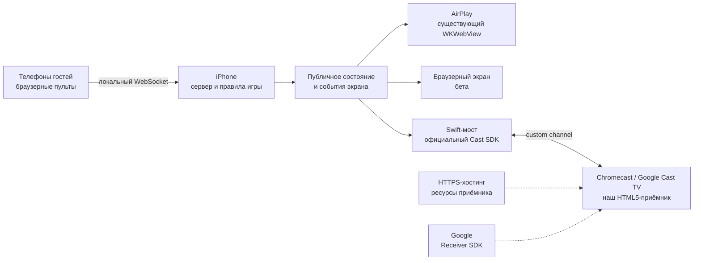

# Chromecast для LocalParty: конкретный план
Проверено 15 сентября 2026 года. Статус: архитектурная рекомендация; Cast SDK и приёмник пока не добавлены.

**Рекомендация:** официальный iOS Sender SDK + собственный Custom Web Receiver. Сервер, правила и игроки остаются на iPhone. Телевизор получает публичное состояние и рисует игру. Не строить основной путь на трансляции видеопотока с телефона.

[Инфраструктурный аудит](./infrastructure-audit-ru.md) · [Игры и UX](./gameplay-product-plan-ru.md)

## Что уже существует и что можно взять

| Источник | Реально полезно | Чего он не даёт |
|---|---|---|
| [Google Cast SDK для iOS](https://developers.google.com/cast/docs/ios_sender/integrate) | Обнаружение устройств, системная Cast-кнопка, управление сессией через GCKCastContext/GCKSessionManager | Игровой протокол, адаптеры нашего runtime и готовую библиотеку party-игр |
| [CastHelloVideo-ios](https://github.com/googlecast/CastHelloVideo-ios), [AppDelegate.swift](https://github.com/googlecast/CastHelloVideo-ios/blob/master/CastHelloVideo-swift/Classes/AppDelegate.swift) | Официальный пример инициализации; код примера под Apache-2.0 | Готовый игровой sender. Медиа-демо, его App ID и демонстрационные данные не переносить как настройки нашего продукта |
| [Custom Web Receiver](https://developers.google.com/cast/docs/web_receiver/basic) и [CastReceiver sample](https://github.com/googlecast/CastReceiver) | Жизненный цикл HTML5-приёмника; Apache-2.0 у репозитория примера | Универсальный запуск нашего /tv. Sample ориентирован на медиа: реклама, очереди и воспроизведение не нужны игровому экрану |
| [Custom messages: Web Receiver](https://developers.google.com/cast/docs/web_receiver/core_features), [iOS advanced](https://developers.google.com/cast/docs/ios_sender/advanced) | Собственный namespace, приём и отправка сообщений через CAF и GCKGenericChannel | Гарантию нужной частоты кадров или задержки в экшен-играх |
| [node-castv2-client](https://github.com/thibauts/node-castv2-client) | Неофициальный Node-клиент протокола, MIT; полезен для знакомства с устройством связи | Основание для надёжной iOS-интеграции. Старые зависимости и отсутствие штатного iOS lifecycle; для продукта предпочтителен SDK |
| [Buzz / couch-kit](https://github.com/faluciano/buzz-tv-party-game) | Пример отдельного приложения-хоста на Android TV | Приёмник для любого Chromecast. Установка Android TV-приложения — другой пользовательский путь |

**Готовые части есть на уровне подключения и обмена сообщениями.** Готового совместимого с LocalParty игрового адаптера в просмотренных репозиториях не найдено. Это не утверждение об отсутствии таких решений во всём интернете.

## Почему недостаточно отправить на TV адрес нашего сервера

Default Media Receiver предназначен для медиа. Наш /tv — интерактивная веб-оболочка с iframe, HTTP-запросами и игровыми соединениями. Выбор типа приёмника описан в [обзоре Google Cast](https://developers.google.com/cast/docs/overview).

Сейчас /tv и игры считают себя страницами одного origin. Сервер выдаёт display-cookie, проверяет origin WebSocket и проксирует разные игровые серверы. Receiver, загруженный с нашего HTTPS-хостинга, окажется на другом origin. Прямая загрузка локальных HTTP/WS-ресурсов потребует отдельной проверки политики устройства, CORS, cookies и всех мостов.

Google разрешает некоторые локальные HTTP-сценарии при разработке; поэтому утверждение «Cast никогда не работает с локальным HTTP» неверно. Но из этого не следует работоспособность нашего набора iframe/WS. [Регистрация и URL приёмника](https://developers.google.com/cast/docs/registration).

**Не ослаблять все origin-проверки и не открывать административный API наружу ради первого успешного соединения.** Прямой доступ receiver к LAN можно испытать как альтернативную ветку, если основной канал окажется узким местом. Решение принимать по физическим устройствам.

## Предлагаемая схема

Сплошные связи — предлагаемый игровой путь. Пунктир — загрузка приложения экрана и SDK. У гостей не появляется новый SDK или обязательная установка. Интернет-хостинг статических ресурсов не означает облачный сервер игровой симуляции.

**Ограничение офлайна:** Google требует загружать Receiver SDK со своего gstatic и не разрешает самостоятельно размещать его даже для разработки. Опубликованный приёмник размещается на сервере с TLS. Поэтому холодный старт Cast нельзя обещать без интернета. Это архитектурный вывод из требований загрузки; поведение уже запущенной игры при потере WAN ещё нужно измерить. [Официальные условия загрузки](https://developers.google.com/cast/docs/web_receiver/basic).

**Ограничение iPhone:** перенос отрисовки на телевизор не отменяет ограничений фонового выполнения iOS. Пока сервер работает в приложении, нельзя обещать, что ведущий заблокирует телефон и партия продолжится. AirPlay-путь также остаётся отдельным режимом со своими условиями.

## Контракт дисплея, который предстоит сделать

Предлагаемый namespace: `urn:x-cast:com.localparty.display`. Название пока проектное.

| Сообщение | Содержимое и смысл |
|---|---|
| receiverReady | Версия протокола и ресурсов, возможности рендеринга; экран действительно загрузился |
| bindDisplay | Привязка текущей сессии экрана к комнате; только права дисплея |
| loadGame | ID игры и экземпляра, версия ресурсов, публичные настройки |
| snapshot | Номер состояния, время симуляции, публичное состояние текущей игры |
| event | ID события, экземпляр игры, тип и полезная нагрузка: результат, переход, подтверждённое попадание |
| resyncRequest | Запрос свежего полного состояния после разрыва или смены версии |
| displayStatus | Готовность, ошибка загрузки, диагностика очереди/отрисовки |

Это наша спецификация, а не готовый протокол Google.

Начальный экран не получает session/admin-токены ведущего или персональные роли игроков. Receiver не командует игрой произвольными сообщениями. Привязка проверяет текущую Cast-сессию и ожидаемый sender; прошлые экземпляры игры отбрасываются. Управление партией остаётся на телефоне.

Лимит custom message — 64 KB; проектировать пакет заметно меньше, например с начальной целью до 24 KB, а не вплотную к пределу. Проверять фактический сериализованный размер. Снимки объединять до самого свежего, события обрабатывать по ID, очередь ограничивать. Число 24 KB — предлагаемый запас, не требование Google. [Документация custom messages](https://developers.google.com/cast/docs/web_receiver/core_features).

Само наличие канала не доказывает, что он выдержит 30–60 больших снимков в секунду. Для танков проверять несколько частот отправки и интерполяцию; для пошаговой физики передавать результаты расчёта и компактное воспроизведение. Не отправлять PNG экрана каждый кадр.

## Изменения по слоям приложения

| Слой | Работа |
|---|---|
| iOS | Добавить официальный SDK, обёртку Cast-кнопки для SwiftUI, lifecycle сессии, мост к локальному серверу и состояния подключения |
| Общий runtime | Ввести display transport; унифицировать выдачу публичных событий и снимков без привязки к конкретному WS/Socket.IO |
| Игровые адаптеры | Перевести сетевой обмен каждого общего экрана на контракт; физику и правила по возможности оставить существующими |
| Receiver | Отдельная небольшая оболочка с CAF, загрузкой ресурсов и обработкой протокола; подключение рендереров игр |
| Сборка | Общая версия игры/протокола/ресурсов; загрузка согласованной версии приёмника; проверка совместимости старого iPhone-приложения с новым хостингом |
| Диагностика | Различать «устройство не найдено», «нет доступа к сети», «приёмник не загрузился», «версии не совпали», «теряется связь» |

Не копировать весь существующий bridge в receiver: он меняет Storage API, предполагает same-origin и обычный браузерный lifecycle. Нужен явно ограниченный адаптер дисплея.

Собственные namespaces объявить до запуска receiver. Для приложения без медиаплеера отдельно настроить поведение простоя: CAF предусматривает disableIdleTimeout именно для non-media apps. Это не повод оставлять бесконечную неподвижную картинку — нужны собственные состояния ожидания, потери ведущего и завершения. [CastReceiverOptions](https://developers.google.com/cast/docs/reference/web_receiver/cast.framework.CastReceiverOptions).

Текущая инструкция Google предлагает CocoaPods или ручное подключение XCFramework; в просмотренном официальном репозитории google-cast-ios-sdk содержимого не оказалось. Поэтому не закладывать «официальный Swift Package» без проверки. Для нашего проекта разумный исходный вариант — официальный XCFramework с зафиксированной версией и контрольной суммой. Понадобятся Bonjour services `_googlecast._tcp` и `_<APPID>._googlecast._tcp`, а также объяснение доступа к локальной сети. [Актуальная установка iOS SDK](https://developers.google.com/cast/docs/ios_sender).

## Условия Google, влияющие на дизайн

Лицензия примеров Apache-2.0 не заменяет условия самого SDK. Для интеграции существенны: собственная регистрация приложения; запуск Cast по действию пользователя; штатная кнопка на верхнем уровне; защита экрана от выгорания; отсутствие постоянного хранения данных на receiver; запрет персональных данных в его console logs. Условия также требуют проектировать совместимость с Cast-приёмниками и не блокировать конкретные устройства. Поэтому снижать графическую нагрузку по возможностям, а не вводить произвольный запрет моделей. [Google Cast Developer Terms, §§ 2, 3.4, 5.1](https://developers.google.com/cast/docs/terms).

Практическое следствие: профили и сохранения остаются на iPhone; receiver использует оперативное состояние. Будущую Cast-кнопку не прятать вместе с браузерной бетой.

Для запуска потребуются собственный App ID и URL приёмника; на этапе разработки — зарегистрированное тестовое устройство. Чужой ID из sample не является нашей конфигурацией. [Регистрация](https://developers.google.com/cast/docs/registration).

## Проверка по трём последовательным прототипам

**A. Комната и викторина.** Подключение с iPhone, игроки видны на TV, готовность, вопрос, ответ, результаты. Отключить/вернуть TV; убедиться, что роли не раскрылись и участникам не пришлось входить заново. Это доказывает интеграцию, но не пригодность для экшена.

**B. Одна игра с рассчитанным движением.** Например, адаптер существующего боулинга либо прототип одновременных бросков. Сервер считает результат; экран воспроизводит траекторию. Проверить одинаковый итог у ведущего, TV и статистики.

**C. Local Tanks.** Тесты с 2, 4 и 8 пультами, взрывами, одновременным вводом и возвратом вкладки из фона. Оценивать отдельно время до первой реакции пульта, время до видимого результата на TV, плавность и рост очереди. Частота игры в каталоге и число игроков в README не заменяют эти замеры.

Минимальная матрица: отдельный Chromecast, современное устройство Google TV и TV со встроенным Cast; как минимум одно устройство с ограниченной производительностью. Домашняя Wi-Fi-сеть, разделённые диапазоны, гостевая сеть с изоляцией клиентов, потеря WAN и блокировка iPhone. Гостевая изолированная сеть может не поддержать этот локальный сценарий; это нужно объяснять в приложении, не оставляя бесконечный spinner.

Начальные **целевые критерии**, а не измеренные показатели: повторное подключение до 10 секунд, восстановление экрана до 5 секунд после доступности канала, отсутствие нарастающего отставания за 20 минут. Для танков — ориентир p95 «ввод → видимая реакция» до 150 мс и устойчивые 30 FPS на выбранном слабом устройстве. Если ощущения плохи даже при формально пройденной цифре, игра не готова. Менять цели после инструментальных и пользовательских проб, сохраняя фактические результаты.

## Продуктовый вывод

Cast расширяет набор телевизоров, сохраняя привлекательный путь «одно приложение у ведущего, браузер у гостей». Приоритет оправдан. Но первая полезная поставка — проверенное подключение и несколько совместимых игр, а не обещание всего каталога на любом TV.

AirPlay остаётся основным готовым способом. Браузерный экран сохранён в настройках как бета. Cast должен появиться в основном выборе общего экрана после испытания сквозного сценария; сейчас кнопка без работающей интеграции в приложение не добавлялась.
